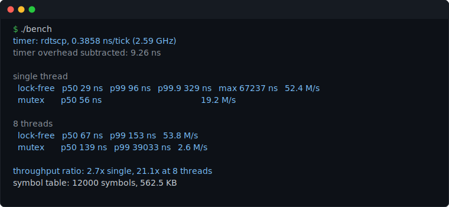
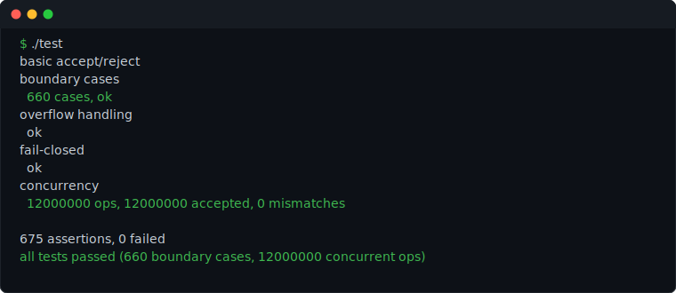

# Pre-trade risk gate

A small, header-only C++20 risk gate that vets orders before they go to an
exchange. Each order is checked against three limits and gets an accept or
reject in tens of nanoseconds:

- **Order size** — is the quantity above the per-order cap?
- **Price band** — is the price within a set percentage of a reference price?
  Catches fat-finger typos like selling at \$1 instead of \$100.
- **Position** — would this order push the net position past its limit?

All arithmetic is `int64` fixed-point, so there's no floating-point drift.
Symbol state lives in a flat array indexed by symbol id, so lookups are O(1)
across the whole universe (12,000 symbols in the benchmark). The position update
is a compare-and-swap loop rather than a lock, so orders on the same symbol can
be checked from multiple threads without double-counting.


## Build and run

Needs a C++20 compiler; no dependencies beyond the standard library.

```bash
make            # builds ./test and ./bench
make run-test   # correctness + concurrency tests
make run-bench  # latency / throughput benchmark
```

Or directly:

```bash
g++ -std=c++20 -O2 -pthread test.cpp  -o test  && ./test
g++ -std=c++20 -O2 -pthread bench.cpp -o bench && ./bench
```

## Using it

```cpp
#include "risk_gate.hpp"
using namespace rg;

RiskGate<12000> gate;                          // universe of 12k symbols
gate.configure(42, SymbolLimits{
    .position_limit  = 10'000,                 // max |net position|
    .reference_price = 100 * PRICE_SCALE,      // $100.0000
    .max_order_size  = 500,                    // per-order qty cap
    .price_band_bps  = 1000,                   // +/-10%
});

Order o{42, Side::Buy, 101 * PRICE_SCALE, 100};
if (accepted(gate.check(o))) {
    // passed risk checks, send to exchange
}
```

## Benchmark

Measured on an x86-64 laptop (Apple clang 17, `-O2 -pthread`). Per-call latency
is timed with `rdtscp`, calibrated against `steady_clock` at startup with the
timer's own overhead subtracted; 10M calls per measurement after a warmup.



| | lock-free | mutex + hash map |
|---|---|---|
| p50 latency (1 thread) | ~25 ns | ~57 ns |
| p99 / p99.9 (1 thread) | ~90 ns / ~330 ns | — |
| throughput (1 thread) | ~52 M/s | ~22 M/s |
| throughput (8 threads) | ~55 M/s | ~2.8 M/s |
| p99 latency (8 threads) | ~140 ns | ~36 µs |

Single-threaded the two are within ~2x, since an uncontended mutex is cheap.
The gap shows up with several threads: the mutex serializes every symbol and its
throughput drops off while p99 latency climbs into microseconds, whereas the
lock-free gate keeps scaling because independent symbols don't block each other.

The `max` latency line (tens of microseconds) is an OS scheduling hiccup over
10M samples, not the gate itself — the p99.9 is the meaningful tail.

## Tests

`test.cpp` covers:

- basic accept/reject for each limit
- 660 boundary cases — exact-at-limit, one below, one above, for all three checks
- overflow: positions and price bands near `INT64_MAX` reject instead of wrapping
- fail-closed: bad symbol id or an unconfigured symbol rejects
- concurrency: 8 threads run 12M orders at a few hot symbols, then the stored
  position is reconciled against an independent recount — they match exactly, so
  no updates were lost or double-counted



## Files

| file | |
|------|--|
| `risk_gate.hpp` | the library: `RiskGate<N>`, the fixed-point types, the checks |
| `test.cpp` | correctness and concurrency tests |
| `bench.cpp` | latency + throughput benchmark against the mutex version |
| `Makefile` | build targets |

## License

MIT — see [LICENSE](LICENSE).
